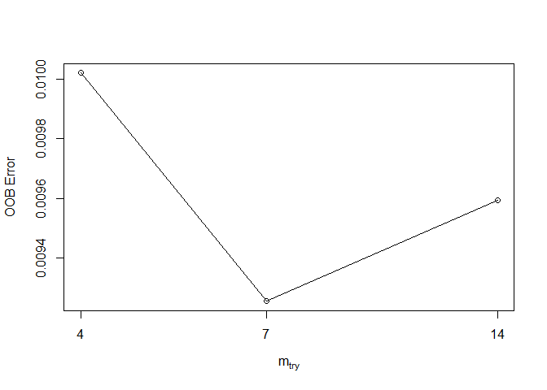

Executive Summary
=================

In the physical movement world, technologies such as Jawbone and FitBit
provide large amounts of data on personal movement and exercise. This
writing takes data from accelerometers and builds a model to quantify
how well an exercise is being performed. This model then takes data
collected from a device an provides feedback on how well the exercise is
performed. This is a classification problem with grades being given on
an A,B,C,D,F scale, with A being the highest. The model that ends up
being used is the random forest model. This writing will show how the
random forest model was selected.

Importing Data and Set Up
-------------------------

First, the packages to be used need to be loaded:

    #Load Packages
    library(caret)

    ## Warning: package 'caret' was built under R version 3.2.4

    library(plyr)
    library(dplyr)
    library(ggplot2)
    library(randomForest)

    ## Warning: package 'randomForest' was built under R version 3.2.4

    library(gbm)

    ## Warning: package 'gbm' was built under R version 3.2.4

    library(adabag)

    ## Warning: package 'adabag' was built under R version 3.2.4

    ## Warning: package 'mlbench' was built under R version 3.2.4

Second, the data to use will be downloaded:

    #Load Data
    train <- read.csv("https://d396qusza40orc.cloudfront.net/predmachlearn/pml-training.csv", na.strings = c("NA","#DIV/0!",""))

Preprocessing
-------------

The data now needs to be prepared in order to build the machine learning
model.The type of model that will be built is for a classification
problem since we are grading with discrete variables and not trying to
come up with a continuous answer. First will be to partition the data
into training and test sets:

    train_model <- createDataPartition(train$classe, p = 0.60, list = FALSE)
    training_set <- train[train_model,]
    test_set <- train[-train_model,]

Before proceeding, a quick str print will help show some important
information about this data set.

    str(training_set)

    ## 'data.frame':    11776 obs. of  160 variables:
    ##  $ X                       : int  1 3 6 8 9 10 11 13 14 15 ...
    ##  $ user_name               : Factor w/ 6 levels "adelmo","carlitos",..: 2 2 2 2 2 2 2 2 2 2 ...
    ##  $ raw_timestamp_part_1    : int  1323084231 1323084231 1323084232 1323084232 1323084232 1323084232 1323084232 1323084232 1323084232 1323084232 ...
    ##  $ raw_timestamp_part_2    : int  788290 820366 304277 440390 484323 484434 500302 560359 576390 604281 ...
    ##  $ cvtd_timestamp          : Factor w/ 20 levels "02/12/2011 13:32",..: 9 9 9 9 9 9 9 9 9 9 ...
    ##  $ new_window              : Factor w/ 2 levels "no","yes": 1 1 1 1 1 1 1 1 1 1 ...
    ##  $ num_window              : int  11 11 12 12 12 12 12 12 12 12 ...
    ##  $ roll_belt               : num  1.41 1.42 1.45 1.42 1.43 1.45 1.45 1.42 1.42 1.45 ...
    ##  $ pitch_belt              : num  8.07 8.07 8.06 8.13 8.16 8.17 8.18 8.2 8.21 8.2 ...
    ##  $ yaw_belt                : num  -94.4 -94.4 -94.4 -94.4 -94.4 -94.4 -94.4 -94.4 -94.4 -94.4 ...
    ##  $ total_accel_belt        : int  3 3 3 3 3 3 3 3 3 3 ...
    ##  $ kurtosis_roll_belt      : num  NA NA NA NA NA NA NA NA NA NA ...
    ##  $ kurtosis_picth_belt     : num  NA NA NA NA NA NA NA NA NA NA ...
    ##  $ kurtosis_yaw_belt       : logi  NA NA NA NA NA NA ...
    ##  $ skewness_roll_belt      : num  NA NA NA NA NA NA NA NA NA NA ...
    ##  $ skewness_roll_belt.1    : num  NA NA NA NA NA NA NA NA NA NA ...
    ##  $ skewness_yaw_belt       : logi  NA NA NA NA NA NA ...
    ##  $ max_roll_belt           : num  NA NA NA NA NA NA NA NA NA NA ...
    ##  $ max_picth_belt          : int  NA NA NA NA NA NA NA NA NA NA ...
    ##  $ max_yaw_belt            : num  NA NA NA NA NA NA NA NA NA NA ...
    ##  $ min_roll_belt           : num  NA NA NA NA NA NA NA NA NA NA ...
    ##  $ min_pitch_belt          : int  NA NA NA NA NA NA NA NA NA NA ...
    ##  $ min_yaw_belt            : num  NA NA NA NA NA NA NA NA NA NA ...
    ##  $ amplitude_roll_belt     : num  NA NA NA NA NA NA NA NA NA NA ...
    ##  $ amplitude_pitch_belt    : int  NA NA NA NA NA NA NA NA NA NA ...
    ##  $ amplitude_yaw_belt      : num  NA NA NA NA NA NA NA NA NA NA ...
    ##  $ var_total_accel_belt    : num  NA NA NA NA NA NA NA NA NA NA ...
    ##  $ avg_roll_belt           : num  NA NA NA NA NA NA NA NA NA NA ...
    ##  $ stddev_roll_belt        : num  NA NA NA NA NA NA NA NA NA NA ...
    ##  $ var_roll_belt           : num  NA NA NA NA NA NA NA NA NA NA ...
    ##  $ avg_pitch_belt          : num  NA NA NA NA NA NA NA NA NA NA ...
    ##  $ stddev_pitch_belt       : num  NA NA NA NA NA NA NA NA NA NA ...
    ##  $ var_pitch_belt          : num  NA NA NA NA NA NA NA NA NA NA ...
    ##  $ avg_yaw_belt            : num  NA NA NA NA NA NA NA NA NA NA ...
    ##  $ stddev_yaw_belt         : num  NA NA NA NA NA NA NA NA NA NA ...
    ##  $ var_yaw_belt            : num  NA NA NA NA NA NA NA NA NA NA ...
    ##  $ gyros_belt_x            : num  0 0 0.02 0.02 0.02 0.03 0.03 0.02 0.02 0 ...
    ##  $ gyros_belt_y            : num  0 0 0 0 0 0 0 0 0 0 ...
    ##  $ gyros_belt_z            : num  -0.02 -0.02 -0.02 -0.02 -0.02 0 -0.02 0 -0.02 0 ...
    ##  $ accel_belt_x            : int  -21 -20 -21 -22 -20 -21 -21 -22 -22 -21 ...
    ##  $ accel_belt_y            : int  4 5 4 4 2 4 2 4 4 2 ...
    ##  $ accel_belt_z            : int  22 23 21 21 24 22 23 21 21 22 ...
    ##  $ magnet_belt_x           : int  -3 -2 0 -2 1 -3 -5 -3 -8 -1 ...
    ##  $ magnet_belt_y           : int  599 600 603 603 602 609 596 606 598 597 ...
    ##  $ magnet_belt_z           : int  -313 -305 -312 -313 -312 -308 -317 -309 -310 -310 ...
    ##  $ roll_arm                : num  -128 -128 -128 -128 -128 -128 -128 -128 -128 -129 ...
    ##  $ pitch_arm               : num  22.5 22.5 22 21.8 21.7 21.6 21.5 21.4 21.4 21.4 ...
    ##  $ yaw_arm                 : num  -161 -161 -161 -161 -161 -161 -161 -161 -161 -161 ...
    ##  $ total_accel_arm         : int  34 34 34 34 34 34 34 34 34 34 ...
    ##  $ var_accel_arm           : num  NA NA NA NA NA NA NA NA NA NA ...
    ##  $ avg_roll_arm            : num  NA NA NA NA NA NA NA NA NA NA ...
    ##  $ stddev_roll_arm         : num  NA NA NA NA NA NA NA NA NA NA ...
    ##  $ var_roll_arm            : num  NA NA NA NA NA NA NA NA NA NA ...
    ##  $ avg_pitch_arm           : num  NA NA NA NA NA NA NA NA NA NA ...
    ##  $ stddev_pitch_arm        : num  NA NA NA NA NA NA NA NA NA NA ...
    ##  $ var_pitch_arm           : num  NA NA NA NA NA NA NA NA NA NA ...
    ##  $ avg_yaw_arm             : num  NA NA NA NA NA NA NA NA NA NA ...
    ##  $ stddev_yaw_arm          : num  NA NA NA NA NA NA NA NA NA NA ...
    ##  $ var_yaw_arm             : num  NA NA NA NA NA NA NA NA NA NA ...
    ##  $ gyros_arm_x             : num  0 0.02 0.02 0.02 0.02 0.02 0.02 0.02 0.02 0.02 ...
    ##  $ gyros_arm_y             : num  0 -0.02 -0.03 -0.02 -0.03 -0.03 -0.03 -0.02 0 0 ...
    ##  $ gyros_arm_z             : num  -0.02 -0.02 0 0 -0.02 -0.02 0 -0.02 -0.03 -0.03 ...
    ##  $ accel_arm_x             : int  -288 -289 -289 -289 -288 -288 -290 -287 -288 -289 ...
    ##  $ accel_arm_y             : int  109 110 111 111 109 110 110 111 111 111 ...
    ##  $ accel_arm_z             : int  -123 -126 -122 -124 -122 -124 -123 -124 -124 -124 ...
    ##  $ magnet_arm_x            : int  -368 -368 -369 -372 -369 -376 -366 -372 -371 -374 ...
    ##  $ magnet_arm_y            : int  337 344 342 338 341 334 339 338 331 342 ...
    ##  $ magnet_arm_z            : int  516 513 513 510 518 516 509 509 523 510 ...
    ##  $ kurtosis_roll_arm       : num  NA NA NA NA NA NA NA NA NA NA ...
    ##  $ kurtosis_picth_arm      : num  NA NA NA NA NA NA NA NA NA NA ...
    ##  $ kurtosis_yaw_arm        : num  NA NA NA NA NA NA NA NA NA NA ...
    ##  $ skewness_roll_arm       : num  NA NA NA NA NA NA NA NA NA NA ...
    ##  $ skewness_pitch_arm      : num  NA NA NA NA NA NA NA NA NA NA ...
    ##  $ skewness_yaw_arm        : num  NA NA NA NA NA NA NA NA NA NA ...
    ##  $ max_roll_arm            : num  NA NA NA NA NA NA NA NA NA NA ...
    ##  $ max_picth_arm           : num  NA NA NA NA NA NA NA NA NA NA ...
    ##  $ max_yaw_arm             : int  NA NA NA NA NA NA NA NA NA NA ...
    ##  $ min_roll_arm            : num  NA NA NA NA NA NA NA NA NA NA ...
    ##  $ min_pitch_arm           : num  NA NA NA NA NA NA NA NA NA NA ...
    ##  $ min_yaw_arm             : int  NA NA NA NA NA NA NA NA NA NA ...
    ##  $ amplitude_roll_arm      : num  NA NA NA NA NA NA NA NA NA NA ...
    ##  $ amplitude_pitch_arm     : num  NA NA NA NA NA NA NA NA NA NA ...
    ##  $ amplitude_yaw_arm       : int  NA NA NA NA NA NA NA NA NA NA ...
    ##  $ roll_dumbbell           : num  13.1 12.9 13.4 12.8 13.2 ...
    ##  $ pitch_dumbbell          : num  -70.5 -70.3 -70.8 -70.3 -70.4 ...
    ##  $ yaw_dumbbell            : num  -84.9 -85.1 -84.5 -85.1 -84.9 ...
    ##  $ kurtosis_roll_dumbbell  : num  NA NA NA NA NA NA NA NA NA NA ...
    ##  $ kurtosis_picth_dumbbell : num  NA NA NA NA NA NA NA NA NA NA ...
    ##  $ kurtosis_yaw_dumbbell   : logi  NA NA NA NA NA NA ...
    ##  $ skewness_roll_dumbbell  : num  NA NA NA NA NA NA NA NA NA NA ...
    ##  $ skewness_pitch_dumbbell : num  NA NA NA NA NA NA NA NA NA NA ...
    ##  $ skewness_yaw_dumbbell   : logi  NA NA NA NA NA NA ...
    ##  $ max_roll_dumbbell       : num  NA NA NA NA NA NA NA NA NA NA ...
    ##  $ max_picth_dumbbell      : num  NA NA NA NA NA NA NA NA NA NA ...
    ##  $ max_yaw_dumbbell        : num  NA NA NA NA NA NA NA NA NA NA ...
    ##  $ min_roll_dumbbell       : num  NA NA NA NA NA NA NA NA NA NA ...
    ##  $ min_pitch_dumbbell      : num  NA NA NA NA NA NA NA NA NA NA ...
    ##  $ min_yaw_dumbbell        : num  NA NA NA NA NA NA NA NA NA NA ...
    ##  $ amplitude_roll_dumbbell : num  NA NA NA NA NA NA NA NA NA NA ...
    ##   [list output truncated]

It can be seen that the first few columns are simply information related
to the observations. This is important to note. The next thing to notice
is there are a lot of columns which contain a lot of NA's. A big part of
solving a classification problem such as this will be to ensure there is
no missing or NA's in the data. Before doing that however, the Nearzero
function in the Caret package can be useful to help identify columns
with repetitive values or minimal variation. These columns do not help
train the model and need to be identified and eliminated.

    #Identify columns with zero variance to remove
    nearzero <- nearZeroVar(training_set)
    training_set2 <- training_set[,-nearzero]

There were almost 40 columns eliminated with near zero. A quick summary
print will show some more details of the remaining columns.

    summary(training_set2)

    ##        X            user_name    raw_timestamp_part_1 raw_timestamp_part_2
    ##  Min.   :    1   adelmo  :2363   Min.   :1.322e+09    Min.   :   294      
    ##  1st Qu.: 4908   carlitos:1901   1st Qu.:1.323e+09    1st Qu.:254670      
    ##  Median : 9804   charles :2100   Median :1.323e+09    Median :500304      
    ##  Mean   : 9799   eurico  :1824   Mean   :1.323e+09    Mean   :502864      
    ##  3rd Qu.:14738   jeremy  :1994   3rd Qu.:1.323e+09    3rd Qu.:758679      
    ##  Max.   :19622   pedro   :1594   Max.   :1.323e+09    Max.   :998801      
    ##                                                                           
    ##           cvtd_timestamp   num_window      roll_belt     
    ##  05/12/2011 11:24: 938   Min.   :  1.0   Min.   :-28.90  
    ##  28/11/2011 14:14: 890   1st Qu.:216.0   1st Qu.:  1.11  
    ##  05/12/2011 14:23: 846   Median :420.0   Median :114.00  
    ##  05/12/2011 11:25: 844   Mean   :428.2   Mean   : 64.75  
    ##  30/11/2011 17:11: 839   3rd Qu.:643.0   3rd Qu.:123.00  
    ##  02/12/2011 13:33: 824   Max.   :864.0   Max.   :162.00  
    ##  (Other)         :6595                                   
    ##    pitch_belt          yaw_belt       total_accel_belt kurtosis_roll_belt
    ##  Min.   :-55.8000   Min.   :-180.00   Min.   : 0.00    Min.   :-2.121    
    ##  1st Qu.:  1.6775   1st Qu.: -88.30   1st Qu.: 3.00    1st Qu.:-1.296    
    ##  Median :  5.3200   Median : -12.25   Median :17.00    Median :-0.882    
    ##  Mean   :  0.2481   Mean   : -10.77   Mean   :11.34    Mean   :-0.093    
    ##  3rd Qu.: 15.2000   3rd Qu.:  13.03   3rd Qu.:18.00    3rd Qu.:-0.148    
    ##  Max.   : 60.2000   Max.   : 179.00   Max.   :29.00    Max.   :33.000    
    ##                                                        NA's   :11540     
    ##  kurtosis_picth_belt skewness_roll_belt skewness_roll_belt.1
    ##  Min.   :-2.190      Min.   :-5.745     Min.   :-7.280      
    ##  1st Qu.:-1.128      1st Qu.:-0.426     1st Qu.:-1.160      
    ##  Median :-0.099      Median :-0.010     Median :-0.080      
    ##  Mean   : 5.596      Mean   :-0.022     Mean   :-0.304      
    ##  3rd Qu.: 4.564      3rd Qu.: 0.399     3rd Qu.: 0.650      
    ##  Max.   :54.000      Max.   : 3.595     Max.   : 7.348      
    ##  NA's   :11555       NA's   :11539      NA's   :11555       
    ##  max_roll_belt     max_picth_belt   max_yaw_belt    min_roll_belt    
    ##  Min.   :-94.300   Min.   : 3.00   Min.   :-2.100   Min.   :-180.00  
    ##  1st Qu.:-88.000   1st Qu.: 5.00   1st Qu.:-1.300   1st Qu.: -88.40  
    ##  Median : -6.000   Median :18.00   Median :-0.900   Median : -13.65  
    ##  Mean   : -7.833   Mean   :12.59   Mean   :-0.092   Mean   : -11.19  
    ##  3rd Qu.: 16.025   3rd Qu.:19.00   3rd Qu.:-0.175   3rd Qu.:   7.75  
    ##  Max.   :180.000   Max.   :30.00   Max.   :33.000   Max.   : 173.00  
    ##  NA's   :11536     NA's   :11536   NA's   :11540    NA's   :11536    
    ##  min_pitch_belt   min_yaw_belt    amplitude_roll_belt amplitude_pitch_belt
    ##  Min.   : 0.00   Min.   :-2.100   Min.   :  0.000     Min.   : 0.000      
    ##  1st Qu.: 3.00   1st Qu.:-1.300   1st Qu.:  0.300     1st Qu.: 1.000      
    ##  Median :16.00   Median :-0.900   Median :  0.910     Median : 1.000      
    ##  Mean   :10.53   Mean   :-0.092   Mean   :  3.352     Mean   : 2.067      
    ##  3rd Qu.:17.00   3rd Qu.:-0.175   3rd Qu.:  2.000     3rd Qu.: 2.000      
    ##  Max.   :23.00   Max.   :33.000   Max.   :360.000     Max.   :10.000      
    ##  NA's   :11536   NA's   :11540    NA's   :11536       NA's   :11536       
    ##  var_total_accel_belt avg_roll_belt    stddev_roll_belt var_roll_belt    
    ##  Min.   : 0.00        Min.   :-20.90   Min.   : 0.000   Min.   :  0.000  
    ##  1st Qu.: 0.10        1st Qu.:  1.10   1st Qu.: 0.200   1st Qu.:  0.000  
    ##  Median : 0.20        Median :115.30   Median : 0.400   Median :  0.100  
    ##  Mean   : 0.87        Mean   : 65.63   Mean   : 1.226   Mean   :  6.478  
    ##  3rd Qu.: 0.30        3rd Qu.:123.02   3rd Qu.: 0.600   3rd Qu.:  0.400  
    ##  Max.   :11.00        Max.   :157.40   Max.   :10.800   Max.   :115.900  
    ##  NA's   :11536        NA's   :11536    NA's   :11536    NA's   :11536    
    ##  avg_pitch_belt    stddev_pitch_belt var_pitch_belt   avg_yaw_belt    
    ##  Min.   :-46.900   Min.   :0.000     Min.   :0.000   Min.   :-94.400  
    ##  1st Qu.:  1.900   1st Qu.:0.200     1st Qu.:0.000   1st Qu.:-88.200  
    ##  Median :  5.000   Median :0.350     Median :0.100   Median : -7.400  
    ##  Mean   : -0.261   Mean   :0.571     Mean   :0.644   Mean   : -9.413  
    ##  3rd Qu.: 14.200   3rd Qu.:0.700     3rd Qu.:0.500   3rd Qu.: 13.825  
    ##  Max.   : 41.000   Max.   :3.100     Max.   :9.500   Max.   :173.400  
    ##  NA's   :11536     NA's   :11536     NA's   :11536   NA's   :11536    
    ##  stddev_yaw_belt    var_yaw_belt        gyros_belt_x      
    ##  Min.   :  0.000   Min.   :    0.000   Min.   :-1.040000  
    ##  1st Qu.:  0.100   1st Qu.:    0.010   1st Qu.:-0.050000  
    ##  Median :  0.300   Median :    0.070   Median : 0.030000  
    ##  Mean   :  1.322   Mean   :  130.950   Mean   :-0.006848  
    ##  3rd Qu.:  0.600   3rd Qu.:    0.382   3rd Qu.: 0.110000  
    ##  Max.   :176.600   Max.   :31183.240   Max.   : 2.200000  
    ##  NA's   :11536     NA's   :11536                          
    ##   gyros_belt_y       gyros_belt_z      accel_belt_x      accel_belt_y   
    ##  Min.   :-0.64000   Min.   :-1.4600   Min.   :-83.000   Min.   :-69.00  
    ##  1st Qu.: 0.00000   1st Qu.:-0.2000   1st Qu.:-21.000   1st Qu.:  3.00  
    ##  Median : 0.02000   Median :-0.1000   Median :-15.000   Median : 35.00  
    ##  Mean   : 0.03904   Mean   :-0.1325   Mean   : -5.481   Mean   : 30.19  
    ##  3rd Qu.: 0.11000   3rd Qu.:-0.0200   3rd Qu.: -5.000   3rd Qu.: 61.00  
    ##  Max.   : 0.63000   Max.   : 1.6200   Max.   : 83.000   Max.   :150.00  
    ##                                                                         
    ##   accel_belt_z     magnet_belt_x   magnet_belt_y   magnet_belt_z   
    ##  Min.   :-275.00   Min.   :-48.0   Min.   :363.0   Min.   :-621.0  
    ##  1st Qu.:-162.00   1st Qu.:  8.0   1st Qu.:581.0   1st Qu.:-375.0  
    ##  Median :-153.00   Median : 34.0   Median :601.0   Median :-320.0  
    ##  Mean   : -73.17   Mean   : 55.8   Mean   :593.6   Mean   :-345.2  
    ##  3rd Qu.:  27.00   3rd Qu.: 60.0   3rd Qu.:610.0   3rd Qu.:-306.0  
    ##  Max.   : 105.00   Max.   :485.0   Max.   :673.0   Max.   : 293.0  
    ##                                                                    
    ##     roll_arm         pitch_arm          yaw_arm          total_accel_arm
    ##  Min.   :-180.00   Min.   :-88.800   Min.   :-180.0000   Min.   : 1.00  
    ##  1st Qu.: -32.80   1st Qu.:-25.600   1st Qu.: -43.4000   1st Qu.:17.00  
    ##  Median :   0.00   Median :  0.000   Median :   0.0000   Median :27.00  
    ##  Mean   :  17.41   Mean   : -4.401   Mean   :  -0.9593   Mean   :25.39  
    ##  3rd Qu.:  77.20   3rd Qu.: 11.600   3rd Qu.:  46.1000   3rd Qu.:33.00  
    ##  Max.   : 180.00   Max.   : 88.500   Max.   : 180.0000   Max.   :65.00  
    ##                                                                         
    ##  var_accel_arm     gyros_arm_x        gyros_arm_y       gyros_arm_z     
    ##  Min.   :  0.00   Min.   :-6.37000   Min.   :-3.4000   Min.   :-2.3300  
    ##  1st Qu.: 10.88   1st Qu.:-1.30000   1st Qu.:-0.8000   1st Qu.:-0.0700  
    ##  Median : 42.35   Median : 0.08000   Median :-0.2600   Median : 0.2500  
    ##  Mean   : 55.14   Mean   : 0.05627   Mean   :-0.2639   Mean   : 0.2728  
    ##  3rd Qu.: 78.98   3rd Qu.: 1.57000   3rd Qu.: 0.1400   3rd Qu.: 0.7200  
    ##  Max.   :331.70   Max.   : 4.87000   Max.   : 2.8400   Max.   : 3.0200  
    ##  NA's   :11536                                                          
    ##   accel_arm_x       accel_arm_y       accel_arm_z       magnet_arm_x   
    ##  Min.   :-404.00   Min.   :-302.00   Min.   :-629.00   Min.   :-580.0  
    ##  1st Qu.:-241.00   1st Qu.: -54.00   1st Qu.:-141.00   1st Qu.:-302.0  
    ##  Median : -42.00   Median :  13.00   Median : -46.00   Median : 293.0  
    ##  Mean   : -60.06   Mean   :  32.06   Mean   : -70.28   Mean   : 190.6  
    ##  3rd Qu.:  83.00   3rd Qu.: 137.00   3rd Qu.:  23.00   3rd Qu.: 636.0  
    ##  Max.   : 435.00   Max.   : 303.00   Max.   : 271.00   Max.   : 782.0  
    ##                                                                        
    ##   magnet_arm_y     magnet_arm_z    kurtosis_roll_arm kurtosis_picth_arm
    ##  Min.   :-386.0   Min.   :-597.0   Min.   :-1.780    Min.   :-2.084    
    ##  1st Qu.:  -9.0   1st Qu.: 136.8   1st Qu.:-1.310    1st Qu.:-1.333    
    ##  Median : 202.5   Median : 447.0   Median :-0.849    Median :-1.044    
    ##  Mean   : 156.9   Mean   : 308.0   Mean   :-0.359    Mean   :-0.654    
    ##  3rd Qu.: 323.0   3rd Qu.: 544.2   3rd Qu.: 0.146    3rd Qu.:-0.371    
    ##  Max.   : 583.0   Max.   : 694.0   Max.   :21.456    Max.   : 9.166    
    ##                                    NA's   :11588     NA's   :11589     
    ##  kurtosis_yaw_arm skewness_roll_arm skewness_pitch_arm skewness_yaw_arm
    ##  Min.   :-2.103   Min.   :-2.128    Min.   :-2.110     Min.   :-6.000  
    ##  1st Qu.:-1.199   1st Qu.:-0.586    1st Qu.:-0.663     1st Qu.:-0.728  
    ##  Median :-0.710   Median : 0.047    Median :-0.030     Median :-0.048  
    ##  Mean   : 0.009   Mean   : 0.079    Mean   :-0.046     Mean   :-0.195  
    ##  3rd Qu.: 0.115   3rd Qu.: 0.790    3rd Qu.: 0.471     3rd Qu.: 0.367  
    ##  Max.   :36.000   Max.   : 4.157    Max.   : 3.043     Max.   : 4.464  
    ##  NA's   :11541    NA's   :11587     NA's   :11589      NA's   :11541   
    ##  max_picth_arm      max_yaw_arm     min_roll_arm     min_yaw_arm   
    ##  Min.   :-173.00   Min.   :14.00   Min.   :-89.10   Min.   : 2.00  
    ##  1st Qu.:   0.00   1st Qu.:30.00   1st Qu.:-42.58   1st Qu.: 8.00  
    ##  Median :  25.00   Median :34.00   Median :-22.05   Median :13.00  
    ##  Mean   :  36.34   Mean   :35.87   Mean   :-21.14   Mean   :14.85  
    ##  3rd Qu.:  92.45   3rd Qu.:42.00   3rd Qu.:  0.00   3rd Qu.:19.25  
    ##  Max.   : 180.00   Max.   :65.00   Max.   : 66.40   Max.   :38.00  
    ##  NA's   :11536     NA's   :11536   NA's   :11536    NA's   :11536  
    ##  amplitude_pitch_arm amplitude_yaw_arm roll_dumbbell     pitch_dumbbell   
    ##  Min.   :  0.00      Min.   : 0.00     Min.   :-152.83   Min.   :-149.59  
    ##  1st Qu.:  3.75      1st Qu.:13.00     1st Qu.: -19.74   1st Qu.: -39.84  
    ##  Median : 54.20      Median :22.00     Median :  48.05   Median : -20.71  
    ##  Mean   : 69.89      Mean   :21.02     Mean   :  23.48   Mean   : -10.67  
    ##  3rd Qu.:114.38      3rd Qu.:29.00     3rd Qu.:  67.77   3rd Qu.:  17.67  
    ##  Max.   :360.00      Max.   :51.00     Max.   : 153.38   Max.   : 129.82  
    ##  NA's   :11536       NA's   :11536                                        
    ##   yaw_dumbbell      kurtosis_roll_dumbbell kurtosis_picth_dumbbell
    ##  Min.   :-148.766   Min.   :-2.105         Min.   :-2.200         
    ##  1st Qu.: -77.702   1st Qu.:-0.622         1st Qu.:-0.692         
    ##  Median :  -4.235   Median :-0.038         Median :-0.140         
    ##  Mean   :   1.497   Mean   : 0.585         Mean   : 0.351         
    ##  3rd Qu.:  79.959   3rd Qu.: 0.879         3rd Qu.: 0.523         
    ##  Max.   : 154.754   Max.   :54.998         Max.   :55.628         
    ##                     NA's   :11540          NA's   :11538          
    ##  skewness_roll_dumbbell skewness_pitch_dumbbell max_roll_dumbbell
    ##  Min.   :-7.384         Min.   :-7.447          Min.   :-70.10   
    ##  1st Qu.:-0.582         1st Qu.:-0.515          1st Qu.:-27.35   
    ##  Median :-0.039         Median :-0.108          Median :  6.40   
    ##  Mean   :-0.132         Mean   :-0.070          Mean   : 11.87   
    ##  3rd Qu.: 0.418         3rd Qu.: 0.468          3rd Qu.: 50.70   
    ##  Max.   : 1.926         Max.   : 2.546          Max.   :129.80   
    ##  NA's   :11539          NA's   :11537           NA's   :11536    
    ##  max_picth_dumbbell max_yaw_dumbbell min_roll_dumbbell min_pitch_dumbbell
    ##  Min.   :-108.00    Min.   :-2.100   Min.   :-134.90   Min.   :-146.20   
    ##  1st Qu.: -68.50    1st Qu.:-0.600   1st Qu.: -60.40   1st Qu.: -93.40   
    ##  Median :  32.30    Median : 0.000   Median : -48.60   Median : -73.80   
    ##  Mean   :  29.73    Mean   : 0.586   Mean   : -43.66   Mean   : -37.97   
    ##  3rd Qu.: 133.35    3rd Qu.: 0.900   3rd Qu.: -28.27   3rd Qu.:  10.35   
    ##  Max.   : 155.00    Max.   :55.000   Max.   :  41.50   Max.   : 116.60   
    ##  NA's   :11536      NA's   :11540    NA's   :11536     NA's   :11536     
    ##  min_yaw_dumbbell amplitude_roll_dumbbell amplitude_pitch_dumbbell
    ##  Min.   :-2.100   Min.   :  0.00          Min.   :  0.00          
    ##  1st Qu.:-0.600   1st Qu.: 13.56          1st Qu.: 17.28          
    ##  Median : 0.000   Median : 35.12          Median : 43.24          
    ##  Mean   : 0.586   Mean   : 55.53          Mean   : 67.70          
    ##  3rd Qu.: 0.900   3rd Qu.: 86.08          3rd Qu.:108.86          
    ##  Max.   :55.000   Max.   :233.19          Max.   :270.84          
    ##  NA's   :11540    NA's   :11536           NA's   :11536           
    ##  total_accel_dumbbell var_accel_dumbbell avg_roll_dumbbell
    ##  Min.   : 0.00        Min.   :  0.000    Min.   :-128.96  
    ##  1st Qu.: 4.00        1st Qu.:  0.410    1st Qu.:  -8.10  
    ##  Median :10.00        Median :  0.993    Median :  51.90  
    ##  Mean   :13.65        Mean   :  4.564    Mean   :  26.36  
    ##  3rd Qu.:19.00        3rd Qu.:  2.914    3rd Qu.:  64.79  
    ##  Max.   :42.00        Max.   :230.428    Max.   : 125.99  
    ##                       NA's   :11536      NA's   :11536    
    ##  stddev_roll_dumbbell var_roll_dumbbell  avg_pitch_dumbbell
    ##  Min.   :  0.000      Min.   :    0.00   Min.   :-70.53    
    ##  1st Qu.:  4.763      1st Qu.:   22.69   1st Qu.:-42.98    
    ##  Median : 12.945      Median :  167.58   Median :-22.33    
    ##  Mean   : 21.018      Mean   : 1022.89   Mean   :-14.29    
    ##  3rd Qu.: 26.323      3rd Qu.:  692.88   3rd Qu.: 10.98    
    ##  Max.   :113.657      Max.   :12917.90   Max.   : 62.02    
    ##  NA's   :11536        NA's   :11536      NA's   :11536     
    ##  stddev_pitch_dumbbell var_pitch_dumbbell avg_yaw_dumbbell  
    ##  Min.   : 0.000        Min.   :   0.00    Min.   :-117.950  
    ##  1st Qu.: 3.227        1st Qu.:  10.41    1st Qu.: -76.921  
    ##  Median : 7.914        Median :  62.62    Median :  -1.711  
    ##  Mean   :13.161        Mean   : 348.48    Mean   :  -2.683  
    ##  3rd Qu.:19.397        3rd Qu.: 376.26    3rd Qu.:  67.146  
    ##  Max.   :62.881        Max.   :3953.97    Max.   : 130.730  
    ##  NA's   :11536         NA's   :11536      NA's   :11536     
    ##  stddev_yaw_dumbbell var_yaw_dumbbell  gyros_dumbbell_x 
    ##  Min.   : 0.000      Min.   :   0.00   Min.   :-1.8600  
    ##  1st Qu.: 4.032      1st Qu.:  16.26   1st Qu.:-0.0300  
    ##  Median :10.677      Median : 114.03   Median : 0.1300  
    ##  Mean   :16.983      Mean   : 593.75   Mean   : 0.1696  
    ##  3rd Qu.:26.247      3rd Qu.: 688.94   3rd Qu.: 0.3500  
    ##  Max.   :93.652      Max.   :8770.75   Max.   : 2.2200  
    ##  NA's   :11536       NA's   :11536                      
    ##  gyros_dumbbell_y   gyros_dumbbell_z  accel_dumbbell_x  accel_dumbbell_y 
    ##  Min.   :-2.10000   Min.   :-2.3800   Min.   :-237.00   Min.   :-189.00  
    ##  1st Qu.:-0.14000   1st Qu.:-0.3100   1st Qu.: -50.00   1st Qu.:  -9.00  
    ##  Median : 0.03000   Median :-0.1300   Median :  -8.00   Median :  41.00  
    ##  Mean   : 0.04392   Mean   :-0.1435   Mean   : -28.23   Mean   :  51.99  
    ##  3rd Qu.: 0.21000   3rd Qu.: 0.0300   3rd Qu.:  11.00   3rd Qu.: 108.00  
    ##  Max.   : 4.37000   Max.   : 1.8700   Max.   : 234.00   Max.   : 302.00  
    ##                                                                          
    ##  accel_dumbbell_z  magnet_dumbbell_x magnet_dumbbell_y magnet_dumbbell_z
    ##  Min.   :-334.00   Min.   :-643.0    Min.   :-3600     Min.   :-262.0   
    ##  1st Qu.:-141.00   1st Qu.:-536.0    1st Qu.:  230     1st Qu.: -45.0   
    ##  Median :  -1.00   Median :-479.0    Median :  309     Median :  12.5   
    ##  Mean   : -38.19   Mean   :-327.4    Mean   :  218     Mean   :  45.0   
    ##  3rd Qu.:  38.00   3rd Qu.:-300.0    3rd Qu.:  390     3rd Qu.:  94.0   
    ##  Max.   : 318.00   Max.   : 583.0    Max.   :  633     Max.   : 452.0   
    ##                                                                         
    ##   roll_forearm    pitch_forearm     yaw_forearm      kurtosis_roll_forearm
    ##  Min.   :-180.0   Min.   :-72.50   Min.   :-180.00   Min.   :-1.752       
    ##  1st Qu.:   0.0   1st Qu.:  0.00   1st Qu.: -68.00   1st Qu.:-1.366       
    ##  Median :  22.1   Median :  9.47   Median :   0.00   Median :-1.089       
    ##  Mean   :  35.0   Mean   : 10.99   Mean   :  19.27   Mean   :-0.587       
    ##  3rd Qu.: 141.0   3rd Qu.: 28.70   3rd Qu.: 109.00   3rd Qu.:-0.610       
    ##  Max.   : 180.0   Max.   : 89.80   Max.   : 180.00   Max.   :40.060       
    ##                                                      NA's   :11588        
    ##  kurtosis_picth_forearm skewness_roll_forearm skewness_pitch_forearm
    ##  Min.   :-2.098         Min.   :-1.841        Min.   :-5.241        
    ##  1st Qu.:-1.331         1st Qu.:-0.391        1st Qu.:-0.863        
    ##  Median :-0.842         Median : 0.034        Median :-0.160        
    ##  Mean   : 0.847         Mean   : 0.021        Mean   :-0.229        
    ##  3rd Qu.: 0.410         3rd Qu.: 0.376        3rd Qu.: 0.648        
    ##  Max.   :33.626         Max.   : 5.856        Max.   : 4.464        
    ##  NA's   :11589          NA's   :11587         NA's   :11589         
    ##  max_roll_forearm max_picth_forearm max_yaw_forearm  min_roll_forearm
    ##  Min.   :-64.00   Min.   :-151.00   Min.   :-1.800   Min.   :-72.50  
    ##  1st Qu.:  0.00   1st Qu.:   0.00   1st Qu.:-1.400   1st Qu.: -7.20  
    ##  Median : 25.60   Median : 112.50   Median :-1.100   Median :  0.00  
    ##  Mean   : 23.59   Mean   :  81.12   Mean   :-0.586   Mean   : -0.07  
    ##  3rd Qu.: 45.05   3rd Qu.: 175.00   3rd Qu.:-0.600   3rd Qu.: 12.82  
    ##  Max.   : 89.80   Max.   : 180.00   Max.   :40.100   Max.   : 62.10  
    ##  NA's   :11536    NA's   :11536     NA's   :11588    NA's   :11536   
    ##  min_pitch_forearm min_yaw_forearm  amplitude_pitch_forearm
    ##  Min.   :-180.00   Min.   :-1.800   Min.   :  0.00         
    ##  1st Qu.:-175.00   1st Qu.:-1.400   1st Qu.:  1.00         
    ##  Median : -63.40   Median :-1.100   Median : 83.15         
    ##  Mean   : -56.22   Mean   :-0.586   Mean   :137.34         
    ##  3rd Qu.:   0.00   3rd Qu.:-0.600   3rd Qu.:351.25         
    ##  Max.   : 167.00   Max.   :40.100   Max.   :359.00         
    ##  NA's   :11536     NA's   :11588    NA's   :11536          
    ##  total_accel_forearm var_accel_forearm avg_roll_forearm  gyros_forearm_x  
    ##  Min.   : 0.00       Min.   :  0.000   Min.   :-177.13   Min.   :-3.3600  
    ##  1st Qu.:29.00       1st Qu.:  5.489   1st Qu.:   0.00   1st Qu.:-0.2100  
    ##  Median :36.00       Median : 22.985   Median :  14.18   Median : 0.0500  
    ##  Mean   :34.75       Mean   : 32.494   Mean   :  35.92   Mean   : 0.1611  
    ##  3rd Qu.:41.00       3rd Qu.: 50.550   3rd Qu.: 112.80   3rd Qu.: 0.5600  
    ##  Max.   :78.00       Max.   :172.606   Max.   : 174.71   Max.   : 3.9700  
    ##                      NA's   :11536     NA's   :11536                      
    ##  gyros_forearm_y    gyros_forearm_z   accel_forearm_x   accel_forearm_y 
    ##  Min.   :-6.65000   Min.   :-8.0900   Min.   :-496.00   Min.   :-632.0  
    ##  1st Qu.:-1.45000   1st Qu.:-0.1800   1st Qu.:-178.00   1st Qu.:  61.0  
    ##  Median : 0.03000   Median : 0.0800   Median : -57.00   Median : 202.0  
    ##  Mean   : 0.06626   Mean   : 0.1414   Mean   : -62.03   Mean   : 166.3  
    ##  3rd Qu.: 1.64000   3rd Qu.: 0.4900   3rd Qu.:  76.00   3rd Qu.: 314.0  
    ##  Max.   : 6.13000   Max.   : 4.3100   Max.   : 477.00   Max.   : 591.0  
    ##                                                                         
    ##  accel_forearm_z   magnet_forearm_x  magnet_forearm_y  magnet_forearm_z
    ##  Min.   :-410.00   Min.   :-1280.0   Min.   :-896.00   Min.   :-973.0  
    ##  1st Qu.:-182.00   1st Qu.: -617.0   1st Qu.:  21.75   1st Qu.: 200.0  
    ##  Median : -40.00   Median : -382.0   Median : 596.00   Median : 513.5  
    ##  Mean   : -55.79   Mean   : -315.5   Mean   : 385.46   Mean   : 395.8  
    ##  3rd Qu.:  26.00   3rd Qu.:  -82.0   3rd Qu.: 738.00   3rd Qu.: 652.0  
    ##  Max.   : 291.00   Max.   :  663.0   Max.   :1480.00   Max.   :1090.0  
    ##                                                                        
    ##  classe  
    ##  A:3348  
    ##  B:2279  
    ##  C:2054  
    ##  D:1930  
    ##  E:2165  
    ##          
    ## 

Reviewing this shows there are still quite a few columns with a large
majority of the data being NA's. Since there is such a large amount of
NA's in these columns, the columns will simply be removed. If there were
less, then they could be imputed, but there are simply too many that it
would not be meaningful. Also, the first six columns will be removed
since they are only identity columns.

    #Remove columns related to identity
    training_set2 <- training_set2[,-c(1:6)]
    #Identify columns that are mainly NA values and remove
    NA_sums <- colSums(is.na(training_set2))
    NA_cols <- NA_sums > 0
    training_set3 <- training_set2[,NA_cols == FALSE]

This leaves the training set with 53 columns. A quick summary print will
validate all columns are meaningful.

    summary(training_set3)

    ##    roll_belt        pitch_belt          yaw_belt       total_accel_belt
    ##  Min.   :-28.90   Min.   :-55.8000   Min.   :-180.00   Min.   : 0.00   
    ##  1st Qu.:  1.11   1st Qu.:  1.6775   1st Qu.: -88.30   1st Qu.: 3.00   
    ##  Median :114.00   Median :  5.3200   Median : -12.25   Median :17.00   
    ##  Mean   : 64.75   Mean   :  0.2481   Mean   : -10.77   Mean   :11.34   
    ##  3rd Qu.:123.00   3rd Qu.: 15.2000   3rd Qu.:  13.03   3rd Qu.:18.00   
    ##  Max.   :162.00   Max.   : 60.2000   Max.   : 179.00   Max.   :29.00   
    ##   gyros_belt_x        gyros_belt_y       gyros_belt_z    
    ##  Min.   :-1.040000   Min.   :-0.64000   Min.   :-1.4600  
    ##  1st Qu.:-0.050000   1st Qu.: 0.00000   1st Qu.:-0.2000  
    ##  Median : 0.030000   Median : 0.02000   Median :-0.1000  
    ##  Mean   :-0.006848   Mean   : 0.03904   Mean   :-0.1325  
    ##  3rd Qu.: 0.110000   3rd Qu.: 0.11000   3rd Qu.:-0.0200  
    ##  Max.   : 2.200000   Max.   : 0.63000   Max.   : 1.6200  
    ##   accel_belt_x      accel_belt_y     accel_belt_z     magnet_belt_x  
    ##  Min.   :-83.000   Min.   :-69.00   Min.   :-275.00   Min.   :-48.0  
    ##  1st Qu.:-21.000   1st Qu.:  3.00   1st Qu.:-162.00   1st Qu.:  8.0  
    ##  Median :-15.000   Median : 35.00   Median :-153.00   Median : 34.0  
    ##  Mean   : -5.481   Mean   : 30.19   Mean   : -73.17   Mean   : 55.8  
    ##  3rd Qu.: -5.000   3rd Qu.: 61.00   3rd Qu.:  27.00   3rd Qu.: 60.0  
    ##  Max.   : 83.000   Max.   :150.00   Max.   : 105.00   Max.   :485.0  
    ##  magnet_belt_y   magnet_belt_z       roll_arm         pitch_arm      
    ##  Min.   :363.0   Min.   :-621.0   Min.   :-180.00   Min.   :-88.800  
    ##  1st Qu.:581.0   1st Qu.:-375.0   1st Qu.: -32.80   1st Qu.:-25.600  
    ##  Median :601.0   Median :-320.0   Median :   0.00   Median :  0.000  
    ##  Mean   :593.6   Mean   :-345.2   Mean   :  17.41   Mean   : -4.401  
    ##  3rd Qu.:610.0   3rd Qu.:-306.0   3rd Qu.:  77.20   3rd Qu.: 11.600  
    ##  Max.   :673.0   Max.   : 293.0   Max.   : 180.00   Max.   : 88.500  
    ##     yaw_arm          total_accel_arm  gyros_arm_x        gyros_arm_y     
    ##  Min.   :-180.0000   Min.   : 1.00   Min.   :-6.37000   Min.   :-3.4000  
    ##  1st Qu.: -43.4000   1st Qu.:17.00   1st Qu.:-1.30000   1st Qu.:-0.8000  
    ##  Median :   0.0000   Median :27.00   Median : 0.08000   Median :-0.2600  
    ##  Mean   :  -0.9593   Mean   :25.39   Mean   : 0.05627   Mean   :-0.2639  
    ##  3rd Qu.:  46.1000   3rd Qu.:33.00   3rd Qu.: 1.57000   3rd Qu.: 0.1400  
    ##  Max.   : 180.0000   Max.   :65.00   Max.   : 4.87000   Max.   : 2.8400  
    ##   gyros_arm_z       accel_arm_x       accel_arm_y       accel_arm_z     
    ##  Min.   :-2.3300   Min.   :-404.00   Min.   :-302.00   Min.   :-629.00  
    ##  1st Qu.:-0.0700   1st Qu.:-241.00   1st Qu.: -54.00   1st Qu.:-141.00  
    ##  Median : 0.2500   Median : -42.00   Median :  13.00   Median : -46.00  
    ##  Mean   : 0.2728   Mean   : -60.06   Mean   :  32.06   Mean   : -70.28  
    ##  3rd Qu.: 0.7200   3rd Qu.:  83.00   3rd Qu.: 137.00   3rd Qu.:  23.00  
    ##  Max.   : 3.0200   Max.   : 435.00   Max.   : 303.00   Max.   : 271.00  
    ##   magnet_arm_x     magnet_arm_y     magnet_arm_z    roll_dumbbell    
    ##  Min.   :-580.0   Min.   :-386.0   Min.   :-597.0   Min.   :-152.83  
    ##  1st Qu.:-302.0   1st Qu.:  -9.0   1st Qu.: 136.8   1st Qu.: -19.74  
    ##  Median : 293.0   Median : 202.5   Median : 447.0   Median :  48.05  
    ##  Mean   : 190.6   Mean   : 156.9   Mean   : 308.0   Mean   :  23.48  
    ##  3rd Qu.: 636.0   3rd Qu.: 323.0   3rd Qu.: 544.2   3rd Qu.:  67.77  
    ##  Max.   : 782.0   Max.   : 583.0   Max.   : 694.0   Max.   : 153.38  
    ##  pitch_dumbbell     yaw_dumbbell      total_accel_dumbbell
    ##  Min.   :-149.59   Min.   :-148.766   Min.   : 0.00       
    ##  1st Qu.: -39.84   1st Qu.: -77.702   1st Qu.: 4.00       
    ##  Median : -20.71   Median :  -4.235   Median :10.00       
    ##  Mean   : -10.67   Mean   :   1.497   Mean   :13.65       
    ##  3rd Qu.:  17.67   3rd Qu.:  79.959   3rd Qu.:19.00       
    ##  Max.   : 129.82   Max.   : 154.754   Max.   :42.00       
    ##  gyros_dumbbell_x  gyros_dumbbell_y   gyros_dumbbell_z  accel_dumbbell_x 
    ##  Min.   :-1.8600   Min.   :-2.10000   Min.   :-2.3800   Min.   :-237.00  
    ##  1st Qu.:-0.0300   1st Qu.:-0.14000   1st Qu.:-0.3100   1st Qu.: -50.00  
    ##  Median : 0.1300   Median : 0.03000   Median :-0.1300   Median :  -8.00  
    ##  Mean   : 0.1696   Mean   : 0.04392   Mean   :-0.1435   Mean   : -28.23  
    ##  3rd Qu.: 0.3500   3rd Qu.: 0.21000   3rd Qu.: 0.0300   3rd Qu.:  11.00  
    ##  Max.   : 2.2200   Max.   : 4.37000   Max.   : 1.8700   Max.   : 234.00  
    ##  accel_dumbbell_y  accel_dumbbell_z  magnet_dumbbell_x magnet_dumbbell_y
    ##  Min.   :-189.00   Min.   :-334.00   Min.   :-643.0    Min.   :-3600    
    ##  1st Qu.:  -9.00   1st Qu.:-141.00   1st Qu.:-536.0    1st Qu.:  230    
    ##  Median :  41.00   Median :  -1.00   Median :-479.0    Median :  309    
    ##  Mean   :  51.99   Mean   : -38.19   Mean   :-327.4    Mean   :  218    
    ##  3rd Qu.: 108.00   3rd Qu.:  38.00   3rd Qu.:-300.0    3rd Qu.:  390    
    ##  Max.   : 302.00   Max.   : 318.00   Max.   : 583.0    Max.   :  633    
    ##  magnet_dumbbell_z  roll_forearm    pitch_forearm     yaw_forearm     
    ##  Min.   :-262.0    Min.   :-180.0   Min.   :-72.50   Min.   :-180.00  
    ##  1st Qu.: -45.0    1st Qu.:   0.0   1st Qu.:  0.00   1st Qu.: -68.00  
    ##  Median :  12.5    Median :  22.1   Median :  9.47   Median :   0.00  
    ##  Mean   :  45.0    Mean   :  35.0   Mean   : 10.99   Mean   :  19.27  
    ##  3rd Qu.:  94.0    3rd Qu.: 141.0   3rd Qu.: 28.70   3rd Qu.: 109.00  
    ##  Max.   : 452.0    Max.   : 180.0   Max.   : 89.80   Max.   : 180.00  
    ##  total_accel_forearm gyros_forearm_x   gyros_forearm_y   
    ##  Min.   : 0.00       Min.   :-3.3600   Min.   :-6.65000  
    ##  1st Qu.:29.00       1st Qu.:-0.2100   1st Qu.:-1.45000  
    ##  Median :36.00       Median : 0.0500   Median : 0.03000  
    ##  Mean   :34.75       Mean   : 0.1611   Mean   : 0.06626  
    ##  3rd Qu.:41.00       3rd Qu.: 0.5600   3rd Qu.: 1.64000  
    ##  Max.   :78.00       Max.   : 3.9700   Max.   : 6.13000  
    ##  gyros_forearm_z   accel_forearm_x   accel_forearm_y 
    ##  Min.   :-8.0900   Min.   :-496.00   Min.   :-632.0  
    ##  1st Qu.:-0.1800   1st Qu.:-178.00   1st Qu.:  61.0  
    ##  Median : 0.0800   Median : -57.00   Median : 202.0  
    ##  Mean   : 0.1414   Mean   : -62.03   Mean   : 166.3  
    ##  3rd Qu.: 0.4900   3rd Qu.:  76.00   3rd Qu.: 314.0  
    ##  Max.   : 4.3100   Max.   : 477.00   Max.   : 591.0

Last, the test set need to match the columns of the training set.

    #Remove columns not used from test set
    col_names <- names(training_set3)
    test_set2 <- test_set[,col_names]

Since this is a classification problem and not a regression problem,
there is no need to remove highly correlated variables.

Model Selection, Evaluation and Training
----------------------------------------

With this type of problem, there are multiple models that can be built.
A couple of things to keep in mind: first, some of these models can take
a long time to run depending on the PC speed. Next, the goal is to
maximize the accuracy, but not result in an overfit of the data. From
the beginning, the random forest is usually the best model for this type
of problem, however this must be proven.

First up will be to test the K-Nearest Neighbors model. This is a very
simple model that simply reviews each class and predicts based on
similar parameters from the training set. This was not done with caret
because of performance issues.

    training_set6 <- training_set3[,1:(length(names(training_set3))-1)]
    test_set6 <- test_set2[,1:(length(names(training_set3))-1)]
    training_label <- training_set3[,length(names(training_set3))]
    test_label <- test_set2[,length(names(training_set3))]
    knn_train2 <- knn3Train(train = training_set6,test = test_set6,cl = training_label, k = 1)
    knn_accuracy <- confusionMatrix(knn_train2,test_label)
    knn_accuracy

    ## Confusion Matrix and Statistics
    ## 
    ##           Reference
    ## Prediction    A    B    C    D    E
    ##          A 2185   30    6   11    3
    ##          B   17 1432   24    4   28
    ##          C    8   36 1304   38   13
    ##          D   15    8   24 1216   24
    ##          E    7   12   10   17 1374
    ## 
    ## Overall Statistics
    ##                                           
    ##                Accuracy : 0.9573          
    ##                  95% CI : (0.9526, 0.9617)
    ##     No Information Rate : 0.2845          
    ##     P-Value [Acc > NIR] : < 2e-16         
    ##                                           
    ##                   Kappa : 0.946           
    ##  Mcnemar's Test P-Value : 0.02125         
    ## 
    ## Statistics by Class:
    ## 
    ##                      Class: A Class: B Class: C Class: D Class: E
    ## Sensitivity            0.9789   0.9433   0.9532   0.9456   0.9528
    ## Specificity            0.9911   0.9885   0.9853   0.9892   0.9928
    ## Pos Pred Value         0.9776   0.9515   0.9321   0.9448   0.9676
    ## Neg Pred Value         0.9916   0.9864   0.9901   0.9893   0.9894
    ## Prevalence             0.2845   0.1935   0.1744   0.1639   0.1838
    ## Detection Rate         0.2785   0.1825   0.1662   0.1550   0.1751
    ## Detection Prevalence   0.2849   0.1918   0.1783   0.1640   0.1810
    ## Balanced Accuracy      0.9850   0.9659   0.9693   0.9674   0.9728

The simply model has produced an accuracy of 95.73 and a kappa of 94.6.
This is not bad considering the simple nature of the KNN model. However,
with a more complicated model, both metrics should improve.

Next, the gradient boosting model will be tested. Once again, the adabag
package is used instead of the caret package because of performance
issues.

    set.seed(3456)
    gbm_train2 <- boosting(classe ~.,data = training_set3)
    gbm_predict <- predict(gbm_train2,training_set3)
    gbm_accuracy <- confusionMatrix(gbm_predict$class,training_set3$classe)
    gbm_accuracy

    ## Confusion Matrix and Statistics
    ## 
    ##           Reference
    ## Prediction    A    B    C    D    E
    ##          A 3293  115    5   19    8
    ##          B   24 2058   78    9   21
    ##          C   23   98 1928   58   41
    ##          D    6    8   43 1826   48
    ##          E    2    0    0   18 2047
    ## 
    ## Overall Statistics
    ##                                          
    ##                Accuracy : 0.947          
    ##                  95% CI : (0.9428, 0.951)
    ##     No Information Rate : 0.2843         
    ##     P-Value [Acc > NIR] : < 2.2e-16      
    ##                                          
    ##                   Kappa : 0.9329         
    ##  Mcnemar's Test P-Value : < 2.2e-16      
    ## 
    ## Statistics by Class:
    ## 
    ##                      Class: A Class: B Class: C Class: D Class: E
    ## Sensitivity            0.9836   0.9030   0.9387   0.9461   0.9455
    ## Specificity            0.9826   0.9861   0.9774   0.9893   0.9979
    ## Pos Pred Value         0.9573   0.9397   0.8976   0.9456   0.9903
    ## Neg Pred Value         0.9934   0.9769   0.9869   0.9894   0.9878
    ## Prevalence             0.2843   0.1935   0.1744   0.1639   0.1838
    ## Detection Rate         0.2796   0.1748   0.1637   0.1551   0.1738
    ## Detection Prevalence   0.2921   0.1860   0.1824   0.1640   0.1755
    ## Balanced Accuracy      0.9831   0.9446   0.9580   0.9677   0.9717

Surprisingly, this model is inferior to the KNN model with an accuracy
of 94.7 and a kappa of 93.29. So bootstrapping is not better in this
situation. It is also important to note that the gbm algorithm was ran
again with cross validation of 10. This method is not shown here because
it took multiple hours to run. When finished, the accuracy and kappa
were slightly inferior to the bootstrapping method.

Last, the random forest model will be evaluated. Some major advantages
are the random forest model is pretty immune to overfit and bias.

    #Train random forest model
    set.seed(3456)
    model <- randomForest(classe ~ .,data = training_set3)
    model_predictions <- predict(model,newdata = training_set3,type = "response")
    model_accuracy <- confusionMatrix(model_predictions,training_set3$classe)
    model

    ## 
    ## Call:
    ##  randomForest(formula = classe ~ ., data = training_set3) 
    ##                Type of random forest: classification
    ##                      Number of trees: 500
    ## No. of variables tried at each split: 7
    ## 
    ##         OOB estimate of  error rate: 0.59%
    ## Confusion matrix:
    ##      A    B    C    D    E  class.error
    ## A 3345    3    0    0    0 0.0008960573
    ## B   12 2259    8    0    0 0.0087757789
    ## C    0    8 2040    6    0 0.0068159688
    ## D    0    0   23 1904    3 0.0134715026
    ## E    0    0    0    6 2159 0.0027713626

The print of the model shows an out of the bag error rate of 0.59 which
is less than 1%. When the predictions are made against the training set,
the following confusion matrix is generated:

    model_accuracy

    ## Confusion Matrix and Statistics
    ## 
    ##           Reference
    ## Prediction    A    B    C    D    E
    ##          A 3348    0    0    0    0
    ##          B    0 2279    0    0    0
    ##          C    0    0 2054    0    0
    ##          D    0    0    0 1930    0
    ##          E    0    0    0    0 2165
    ## 
    ## Overall Statistics
    ##                                      
    ##                Accuracy : 1          
    ##                  95% CI : (0.9997, 1)
    ##     No Information Rate : 0.2843     
    ##     P-Value [Acc > NIR] : < 2.2e-16  
    ##                                      
    ##                   Kappa : 1          
    ##  Mcnemar's Test P-Value : NA         
    ## 
    ## Statistics by Class:
    ## 
    ##                      Class: A Class: B Class: C Class: D Class: E
    ## Sensitivity            1.0000   1.0000   1.0000   1.0000   1.0000
    ## Specificity            1.0000   1.0000   1.0000   1.0000   1.0000
    ## Pos Pred Value         1.0000   1.0000   1.0000   1.0000   1.0000
    ## Neg Pred Value         1.0000   1.0000   1.0000   1.0000   1.0000
    ## Prevalence             0.2843   0.1935   0.1744   0.1639   0.1838
    ## Detection Rate         0.2843   0.1935   0.1744   0.1639   0.1838
    ## Detection Prevalence   0.2843   0.1935   0.1744   0.1639   0.1838
    ## Balanced Accuracy      1.0000   1.0000   1.0000   1.0000   1.0000

This shows an accuracy of 100 and a kappa of 100. With these numbers,
the random forest model is the model to use for this data set.

Tuning the Model
----------------

Now that the random forest model has been selected, the model needs to
be tuned for maximum accuracy and kappa. First, a plot of the model
shows the point at which the trees are not effective at reducing the
error.

    plot(model)

<!-- -->

Next, there are two parameters to tune. First is the number of trees and
second is the mtry. The number of trees will help determine how many
trees to use to stabilize the error but avoid overfitting. The mtry will
help to minimize the OOBerror.

    #Tune random forest model
    ntrees <- which.min(model$err.rate[,1])
    tune_rf <- tuneRF(training_set3[,-53],training_set3[,53])

    ## mtry = 7  OOB error = 0.93% 
    ## Searching left ...
    ## mtry = 4     OOB error = 1% 
    ## -0.08256881 0.05 
    ## Searching right ...
    ## mtry = 14    OOB error = 0.96% 
    ## -0.03669725 0.05

<!-- -->

    rf_mtry <- tune_rf[tune_rf[,2]==min(tune_rf),1]

The number of trees to use is 491 and the mtry setting to use is 7, as
seen by the graph produced by tune\_rf.

Next, the tuned random forest model will be fit and evaluated.

    #Train tuned random forest model
    set.seed(3456)
    model_n <- randomForest(classe ~ .,data = training_set3, ntree = ntrees, mtry = rf_mtry)
    model_n

    ## 
    ## Call:
    ##  randomForest(formula = classe ~ ., data = training_set3, ntree = ntrees,      mtry = rf_mtry) 
    ##                Type of random forest: classification
    ##                      Number of trees: 491
    ## No. of variables tried at each split: 7
    ## 
    ##         OOB estimate of  error rate: 0.58%
    ## Confusion matrix:
    ##      A    B    C    D    E  class.error
    ## A 3346    2    0    0    0 0.0005973716
    ## B   12 2259    8    0    0 0.0087757789
    ## C    0    8 2040    6    0 0.0068159688
    ## D    0    0   23 1904    3 0.0134715026
    ## E    0    0    0    6 2159 0.0027713626

It can be seen that the OOB error has been reduced to 0.59 from 0.58.
This is a sufficient reduction and cannot really be optimized further.

Evaluating the Model on the Test Set
------------------------------------

Now that the final model is built, the evaluation can be done on the
test set split from the original data.

    predictions <- predict(model_n,newdata = test_set2,type = "response")
    accuracy <- confusionMatrix(predictions,test_set2$classe)
    accuracy

    ## Confusion Matrix and Statistics
    ## 
    ##           Reference
    ## Prediction    A    B    C    D    E
    ##          A 2232    6    0    0    0
    ##          B    0 1512   11    0    1
    ##          C    0    0 1356   20    0
    ##          D    0    0    1 1266    2
    ##          E    0    0    0    0 1439
    ## 
    ## Overall Statistics
    ##                                           
    ##                Accuracy : 0.9948          
    ##                  95% CI : (0.9929, 0.9962)
    ##     No Information Rate : 0.2845          
    ##     P-Value [Acc > NIR] : < 2.2e-16       
    ##                                           
    ##                   Kappa : 0.9934          
    ##  Mcnemar's Test P-Value : NA              
    ## 
    ## Statistics by Class:
    ## 
    ##                      Class: A Class: B Class: C Class: D Class: E
    ## Sensitivity            1.0000   0.9960   0.9912   0.9844   0.9979
    ## Specificity            0.9989   0.9981   0.9969   0.9995   1.0000
    ## Pos Pred Value         0.9973   0.9921   0.9855   0.9976   1.0000
    ## Neg Pred Value         1.0000   0.9991   0.9981   0.9970   0.9995
    ## Prevalence             0.2845   0.1935   0.1744   0.1639   0.1838
    ## Detection Rate         0.2845   0.1927   0.1728   0.1614   0.1834
    ## Detection Prevalence   0.2852   0.1942   0.1754   0.1617   0.1834
    ## Balanced Accuracy      0.9995   0.9971   0.9941   0.9920   0.9990

The results are surely impressive. The accuracy came out to be 99.48 and
the kappa 99.34. The confusion matrix shows relatively few mistakes made
by the prediction model. These are results that can be accepted.

Conclusion
----------

In conclusion, evidence shows the random forest model is the model to
use here. It had a small error rate and the accuracy and kappa ratings
carried over to the test set predictions. It is now possible to
determine if a workout is being performed properly with a high level of
accuracy.
